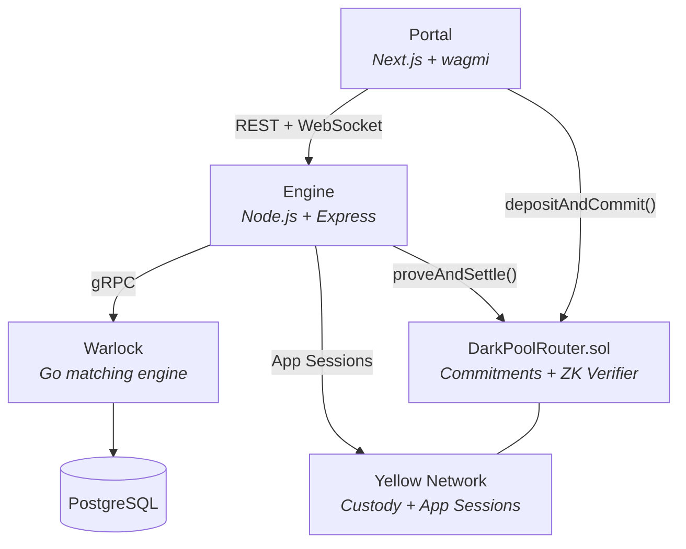

# Dark Pool

A permissionless, decentralized OTC desk for peer-to-peer trading. Where price discovery is intent based, not market based. 

## Thesis

Traditional dark pools are centralized — the operator sees everything and you trust them not to front-run you. On-chain order books fix the trust problem but leak trade details to the entire network. Dark Pool takes a different approach: orders are committed as hashes so the chain never sees trade details, matching happens off-chain with price-time priority, and ZK proofs verify that everything was done honestly. Settlement goes through [Yellow Network](https://yellow.org)'s state channel layer, which means no bridges, no challenge periods, and users can withdraw on whichever chain they want.

## Architecture



**Portal** — Frontend. Wallet connection via RainbowKit, Poseidon hash computation client-side, on-chain deposits, real-time order updates over WebSocket.

**Engine** — Orchestrator. Receives matches from Warlock, generates Groth16 ZK proofs, submits them on-chain, then opens and closes Yellow Network App Sessions to move funds between counterparties.

**Warlock** — Matching engine. Price-time priority with partial fill support. Receives orders over gRPC, stores state in Postgres, streams match events back to the Engine.

**DarkPoolRouter** — On-chain contract. Stores Poseidon hash commitments, verifies Groth16 proofs, tracks partial fills, and coordinates deposits with Yellow Network Custody.

## How It Works

1. User submits an order — the frontend hashes it with Poseidon and calls `depositAndCommit()` on-chain. Collateral goes into Yellow Custody, the chain only stores the hash.
2. Order details go to Warlock over gRPC. When a counterparty match is found, Warlock streams the match back to the Engine.
3. The Engine generates a Groth16 ZK proof and calls `proveAndSettle()` on-chain. The contract verifies the proof without ever learning the order details.
4. The Engine opens a Yellow Network App Session between the two parties and closes it with swapped allocations. Done — no bridging, no waiting.

## Yellow Network

Settlement uses Yellow's state channel framework with the "Game with Judge" governance model. The Engine operates as a clearnode with full signing authority, enabling instant settlement with no challenge period. Users sign once at wallet connect (session keys with 30-day expiry) and every subsequent trade settles without further interaction.

Yellow's unified balance layer makes this chain-agnostic. Deploy the Router on any EVM chain, matching works the same. Users withdraw on whichever chain they want.

## Running It

```bash
git clone https://github.com/0xjackson/Dark-Pool.git && cd Dark-Pool
cp .env.example .env
npm run docker:up && npm run migrate
```

OR

Navigate to: https://portal-production-7c82.up.railway.app/

## License

MIT
