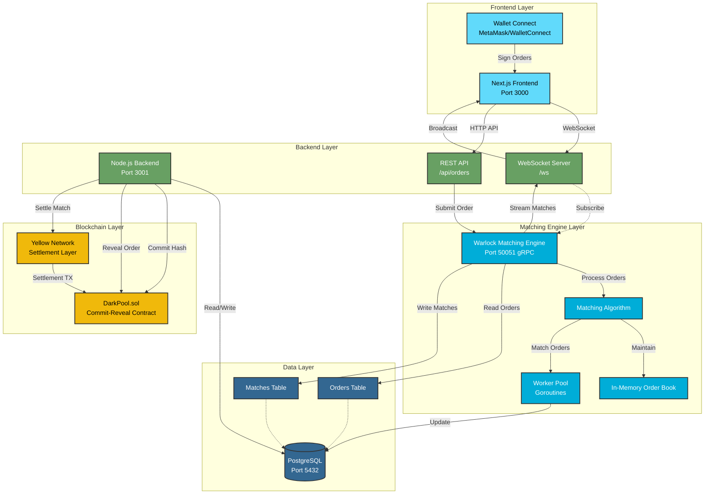
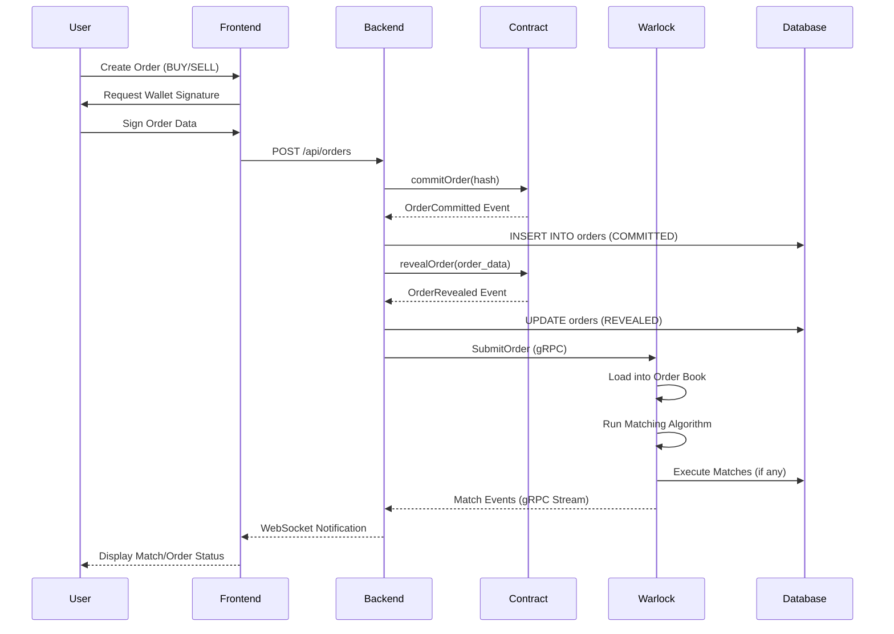
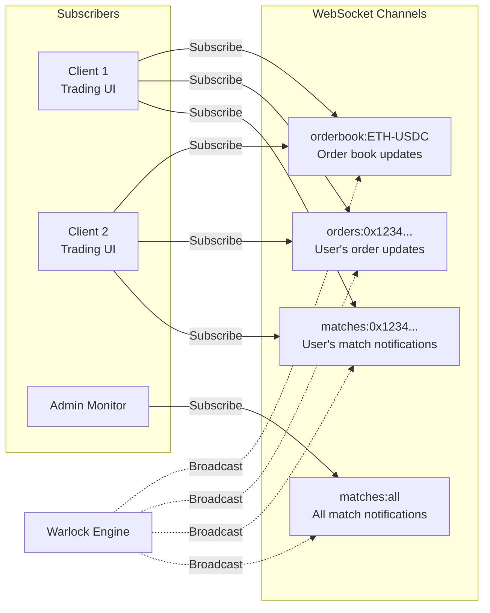

# Dark Pool Architecture

## System Overview

The Dark Pool is a decentralized order matching system that uses a **commit-reveal pattern** to prevent front-running and supports **variance/slippage tolerance** for flexible order matching. The system consists of four main components:

1. **Frontend** (Next.js) - User interface for trading
2. **Backend** (Node.js) - API server and WebSocket hub
3. **Warlock** (Go) - High-performance matching engine
4. **PostgreSQL** - Shared database for orders and matches

## Architecture Diagram



## Data Flow

### 1. Order Submission Flow



### 2. Matching Algorithm Flow

```mermaid
flowchart TD
    Start[New Order Arrives] --> AddBook[Add to Order Book]
    AddBook --> Query[Query Opposite Side<br/>from Database]

    Query --> Filter{Price Compatible?<br/>buy.max >= sell.min}
    Filter -->|No| NoMatch[No Match]
    Filter -->|Yes| Sort[Sort by Price-Time Priority]

    Sort --> Loop{More Candidates?}
    Loop -->|No| Done[Done]
    Loop -->|Yes| Check{Order Fully Filled?}

    Check -->|Yes| Done
    Check -->|No| CalcQty[Calculate Match Quantity<br/>min(remaining, candidate.remaining)]

    CalcQty --> CalcPrice[Calculate Execution Price<br/>avg(buy.price, sell.price)]
    CalcPrice --> Transaction[Begin DB Transaction]

    Transaction --> InsertMatch[INSERT INTO matches]
    InsertMatch --> UpdateBuy[UPDATE buy order]
    UpdateBuy --> UpdateSell[UPDATE sell order]
    UpdateSell --> Commit[Commit Transaction]

    Commit --> Notify[Stream Match Event]
    Notify --> UpdateBook[Update In-Memory Book]
    UpdateBook --> Loop

    NoMatch --> Done
    Done --> End[Return Results]

    style Start fill:#90EE90
    style End fill:#FFB6C1
    style Transaction fill:#FFE4B5
    style Notify fill:#ADD8E6
```

### 3. WebSocket Channels



## Component Details

### Frontend (Next.js)

**Technology:** Next.js 14, React, TypeScript, TailwindCSS, Wagmi

**Responsibilities:**
- User interface for trading
- Wallet integration (MetaMask, WalletConnect)
- Order form with variance slider
- Real-time order book display
- Order history and match notifications
- WebSocket client for real-time updates

**Key Files:**
- `app/web/src/components/trading/OrderForm.tsx` - Order submission UI
- `app/web/src/components/trading/OrderBook.tsx` - Order book display
- `app/web/src/components/trading/OrderHistory.tsx` - User's orders
- `app/web/src/hooks/useOrderBook.ts` - WebSocket hook

### Backend (Node.js)

**Technology:** Node.js, Express, TypeScript, gRPC, WebSocket (ws)

**Responsibilities:**
- REST API for order management
- WebSocket server for real-time updates
- gRPC client to Warlock matching engine
- Smart contract interactions (commit-reveal)
- Yellow Network settlement integration
- Database queries for order history

**Key Files:**
- `app/server/src/server.ts` - Main server entry point
- `app/server/src/routes/orders.ts` - Order API endpoints
- `app/server/src/services/warlockClient.ts` - gRPC client wrapper
- `app/server/src/websocket/server.ts` - WebSocket server
- `app/server/src/services/yellowNetwork.ts` - Yellow SDK integration

**API Endpoints:**
- `POST /api/orders` - Create order
- `GET /api/orders/:id` - Get order by ID
- `GET /api/orders/user/:address` - Get user's orders
- `DELETE /api/orders/:id` - Cancel order
- `GET /api/orderbook/:base/:quote` - Get order book
- `GET /api/matches/user/:address` - Get user's matches
- `GET /health` - Health check
- `WS /ws` - WebSocket connection

### Warlock (Go)

**Technology:** Go 1.22, gRPC, pgx (PostgreSQL), shopspring/decimal

**Responsibilities:**
- High-performance order matching
- In-memory order book management
- Price-time priority matching algorithm
- Variance/slippage tolerance support
- Worker pool for concurrent processing
- gRPC API for order submission
- Match event streaming

**Key Files:**
- `warlock/cmd/warlock/main.go` - Service entry point
- `warlock/internal/matcher/engine.go` - Matching engine core
- `warlock/internal/matcher/orderbook.go` - In-memory order book
- `warlock/internal/matcher/algorithm.go` - Matching algorithm
- `warlock/internal/grpc/server.go` - gRPC server
- `warlock/pkg/api/proto/warlock.proto` - gRPC API definition

**Performance Targets:**
- 100-1000 orders/sec throughput
- <1ms matching latency (in-memory)
- <10ms database query latency
- Worker pool scales with CPU cores

### Database (PostgreSQL)

**Technology:** PostgreSQL 16

**Schema:**

**Orders Table:**
- Stores all order states (PENDING → COMMITTED → REVEALED → FILLED)
- Supports variance tolerance (min_price, max_price)
- Tracks fill quantities (filled_quantity, remaining_quantity)
- Commit-reveal fields (commitment_hash, commitment_tx)
- Optimized indexes for matching queries

**Matches Table:**
- Records executed trades
- Settlement tracking (Yellow Network session ID)
- Links to buy and sell orders
- Settlement status tracking

**Key Indexes:**
- `idx_orders_matching_buy` - BUY orders by max_price DESC
- `idx_orders_matching_sell` - SELL orders by min_price ASC
- `idx_orders_user` - User's orders by created_at DESC
- `idx_matches_orders` - Matches by order IDs

### Smart Contracts (Solidity)

**Technology:** Solidity 0.8.20, Foundry

**DarkPool.sol:**
- Commit-reveal pattern to prevent front-running
- `commitOrder(hash)` - Commit order hash on-chain
- `revealOrder(...)` - Reveal order details after commitment
- `cancelCommitment(hash)` - Cancel a commitment
- Minimum reveal delay (1 block) prevents same-block reveals
- Commitment expiration (1 hour) prevents stale commitments

**Deployment:**
```bash
forge script script/DeployDarkPool.s.sol --rpc-url $RPC_URL --broadcast
```

## Variance/Slippage Tolerance

### How It Works

Orders specify a **variance_bps** (basis points) that determines acceptable price range:

- `variance_bps = 100` → 1% slippage tolerance
- `variance_bps = 200` → 2% slippage tolerance
- `variance_bps = 10000` → 100% slippage (match any price)

**Price Calculation:**
```
min_price = price × (1 - variance_bps / 10000)
max_price = price × (1 + variance_bps / 10000)
```

**Matching Condition:**
```
BUY matches SELL when: buy.max_price >= sell.min_price
```

### Example

**Order A:** BUY 1000 ETH @ $2000, variance 2% (200 bps)
- min_price = $1960
- max_price = $2040

**Matches:**
- ✅ SELL 600 ETH @ $1990 (within range)
- ✅ SELL 400 ETH @ $2030 (within range)
- ❌ SELL 500 ETH @ $2050 (above max_price)

## Security Considerations

1. **Commit-Reveal Pattern:**
   - Orders are committed as hash on-chain before revealing
   - Prevents front-running by hiding order details
   - Minimum 1-block delay between commit and reveal

2. **Signature Verification:**
   - All orders must be signed by user's wallet
   - Backend verifies signatures before submission

3. **gRPC Security:**
   - Production: Use mTLS for authentication
   - Development: Insecure (localhost only)

4. **Rate Limiting:**
   - API endpoints should implement rate limiting
   - Prevent spam order submission

5. **Input Validation:**
   - Positive quantities and prices
   - Variance within 0-10000 bps
   - Valid token addresses

6. **Database:**
   - Parameterized queries (prevent SQL injection)
   - Connection pooling
   - Regular backups

## Deployment

### Local Development

```bash
# 1. Start all services
docker-compose up

# 2. Run database migrations
docker exec -i darkpool-postgres psql -U darkpool -d darkpool < warlock/migrations/001_initial_schema.up.sql

# 3. Access services
# - Frontend: http://localhost:3000
# - Backend: http://localhost:3001
# - Warlock gRPC: localhost:50051
# - PostgreSQL: localhost:5432
```

### Production Deployment

1. **Build Docker images:**
```bash
docker build -t darkpool-frontend:v1.0.0 ./app/web
docker build -t darkpool-backend:v1.0.0 ./app/server
docker build -t darkpool-warlock:v1.0.0 ./warlock
```

2. **Deploy to Kubernetes/Cloud:**
- Use managed PostgreSQL (RDS, Cloud SQL)
- Enable TLS/SSL for all connections
- Configure secrets management
- Set up monitoring (Prometheus, Grafana)
- Enable auto-scaling for Warlock workers

3. **Deploy Smart Contract:**
```bash
cd contracts
forge script script/DeployDarkPool.s.sol \
  --rpc-url $RPC_URL \
  --private-key $PRIVATE_KEY \
  --broadcast \
  --verify
```

## Monitoring & Observability

### Metrics to Track

**Warlock:**
- Orders processed per second
- Match rate (% of orders matched)
- Average matching latency (p50, p95, p99)
- Worker pool utilization
- Database query latency

**Backend:**
- API request latency
- WebSocket active connections
- gRPC call success rate
- Error rates

**Database:**
- Query performance (EXPLAIN ANALYZE)
- Connection pool utilization
- Table sizes
- Index usage

### Logging

All components use structured logging:
- **Warlock:** zerolog (Go)
- **Backend:** console.log / pino (Node.js)
- **Frontend:** console (development)

### Health Checks

- `GET /health` - Backend health (includes Warlock status)
- `HealthCheck` gRPC call - Warlock health
- Database connectivity checks

## Testing Strategy

### Unit Tests
- Matching algorithm logic
- Order book operations
- Price-time priority
- Variance calculations

### Integration Tests
- Full order lifecycle (commit → reveal → match)
- gRPC communication (Backend ↔ Warlock)
- Database transactions
- WebSocket subscriptions

### Load Tests
- Simulate 100-1000 orders/sec
- Measure latency percentiles
- Test database connection pool
- Verify concurrent matching

### E2E Tests
- Frontend → Backend → Warlock → Settlement
- Test with real wallets on testnet
- Verify smart contract interactions

## Future Enhancements

1. **Advanced Order Types:**
   - Limit orders with expiration
   - Stop-loss orders
   - Iceberg orders (partial visibility)

2. **MEV Protection:**
   - Batch auctions
   - Threshold encryption
   - Fair ordering mechanisms

3. **Cross-Chain Matching:**
   - Support multiple blockchains
   - Bridge integration for settlement

4. **Market Making:**
   - Automated market maker integration
   - Liquidity incentives

5. **Analytics:**
   - Trading volume metrics
   - Order book depth charts
   - Historical price data

## References

- **gRPC:** https://grpc.io/
- **PostgreSQL:** https://www.postgresql.org/
- **Yellow Network:** https://yellow.org/
- **Foundry:** https://book.getfoundry.sh/
- **Next.js:** https://nextjs.org/
- **Go:** https://golang.org/
