# 🌑 Dark Pool - System Architecture

> Dark Pool is a private, peer-to-peer trading protocol for large crypto trades. Right now, if you want to sell $1M worth of ETH on Uniswap, everyone sees your order before it executes - bots front-run you, sandwich you, and you lose tens of thousands to slippage. It's broken. We fix this by letting you submit encrypted orders that get matched directly with other traders, completely off-chain and invisible to the public. When a match is found, settlement happens atomically through a Uniswap v4 hook - but here's the key: before any trade executes, our on-chain Constraint Contract verifies that you're getting at least the minimum price you specified (using Pyth oracle prices locked at order creation). If the match doesn't meet your requirements, the contract simply rejects it and your funds stay safe. No liquidity pools, no bank run risk, no MEV extraction - just pure P2P trading with trustless slippage guarantees. We're building the dark pool that TradFi has had for decades, but fully on-chain and non-custodial.

---

## 📊 System Overview

```mermaid
flowchart TB
    subgraph Title[" "]
        T1["🌑 DARK POOL PROTOCOL"]
        T2["Trustless P2P Large-Block Trading"]
    end

    subgraph Users["👥 USERS"]
        W1["🐋 Whales"]
        W2["🏦 Institutions"]
        W3["🤖 Market Makers"]
    end

    subgraph Client["🖥️ CLIENT LAYER"]
        direction TB
        CW["🦊 Wallet Connect<br/>━━━━━━━━━━━━━<br/>MetaMask / WalletConnect<br/>Sign transactions"]
        CU["🎨 Trading UI<br/>━━━━━━━━━━━━━<br/>Order form<br/>Set slippage tolerance<br/>View order status"]
        CN["🔔 Notifications<br/>━━━━━━━━━━━━━<br/>Match alerts<br/>Settlement confirmations"]
    end

    subgraph Server["⚙️ SERVER LAYER"]
        direction TB
        SA["🌐 API Gateway<br/>━━━━━━━━━━━━━<br/>REST + WebSocket<br/>Order submission<br/>Status polling"]
        SY["🟡 Yellow SDK<br/>━━━━━━━━━━━━━<br/>Clearnode connection<br/>State channel mgmt<br/>Signature relay"]
        SO["📊 Order Manager<br/>━━━━━━━━━━━━━<br/>Track active orders<br/>Match notifications<br/>Settlement coordination"]
        SD[("💾 Database<br/>━━━━━━━━━━━━━<br/>Order history<br/>User preferences")]
    end

    subgraph Constraints["📜 CONSTRAINT CONTRACT"]
        direction TB
        CL["🔒 Lock Assets<br/>━━━━━━━━━━━━━<br/>User's tokens locked<br/>until settled/cancelled"]
        CO["📊 Oracle Query<br/>━━━━━━━━━━━━━<br/>Pyth: ETH = $2,000"]
        CC["🧮 Calculate Min<br/>━━━━━━━━━━━━━<br/>500 × $2,000 × 0.99<br/>= $990,000 USDC min"]
        CS["💾 Store On-Chain<br/>━━━━━━━━━━━━━<br/>minBuyAmount<br/>expiry, slippage"]
        
        CL --> CO --> CC --> CS
    end

    subgraph Yellow["🟡 YELLOW NETWORK"]
        direction TB
        YE["🔐 Encrypted Orders<br/>━━━━━━━━━━━━━<br/>Price + size hidden"]
        YO["📒 Dark Orderbook<br/>━━━━━━━━━━━━━<br/>Off-chain matching"]
        YM["⚡ P2P Matching<br/>━━━━━━━━━━━━━<br/>Find counterparty"]
        YS["✍️ Signatures<br/>━━━━━━━━━━━━━<br/>Both parties sign"]
        
        YE --> YO --> YM --> YS
    end

    subgraph Hook["🦄 UNISWAP V4 HOOK"]
        direction TB
        HV["🔍 Verify Sigs<br/>━━━━━━━━━━━━━<br/>Both parties signed?"]
        HC["📞 Call Constraints<br/>━━━━━━━━━━━━━<br/>verifyAndSettle()"]
        HD{"🛡️ Check<br/>$995k ≥ $990k?"}
        HE["⚛️ Atomic Settle<br/>━━━━━━━━━━━━━<br/>P2P via PoolManager"]
        HX["❌ REVERT<br/>━━━━━━━━━━━━━<br/>User protected"]
        
        HV --> HC --> HD
        HD -->|"✅ Yes"| HE
        HD -->|"❌ No"| HX
    end

    subgraph Settlement["✅ ATOMIC SETTLEMENT"]
        direction LR
        S1["500 ETH<br/>Seller → Buyer"]
        S2["$995,000 USDC<br/>Buyer → Seller"]
    end

    Users --> Client
    Client --> Server
    Server --> Constraints
    Server <--> Yellow
    Constraints --> Yellow
    Yellow --> Hook
    HE --> Settlement
```

---

## 🔄 Sequence Diagram

```mermaid
sequenceDiagram
    autonumber
    
    participant User as 👤 Seller
    participant Client as 🖥️ Client<br/>(React dApp)
    participant Server as ⚙️ Server<br/>(API + Yellow SDK)
    participant Constraint as 📜 Constraint<br/>Contract
    participant Pyth as 🔮 Pyth<br/>Oracle
    participant Yellow as 🟡 Yellow<br/>Clearnode
    participant Buyer as 👤 Buyer
    participant Hook as 🦄 v4 Hook
    participant PM as 🎱 Pool<br/>Manager

    rect rgb(99, 102, 241, 0.15)
        Note over User,PM: 🖥️ PHASE 0: CLIENT INTERACTION
        
        User->>Client: Connect wallet (MetaMask)
        Client->>Client: Load trading UI
        User->>Client: "Sell 500 ETH, max 1% slippage"
        Client->>Client: Validate inputs
        Client->>Server: POST /orders (sellToken, amount, slippage)
    end

    rect rgb(139, 92, 246, 0.15)
        Note over User,PM: ⚙️ PHASE 1: SERVER PROCESSING
        
        Server->>Server: Generate order params
        Server->>Pyth: Fetch fresh price update
        Pyth-->>Server: priceUpdateData
        Server->>Constraint: createOrder(ETH, USDC, 500, 100bps, expiry, priceUpdate)
    end

    rect rgb(16, 185, 129, 0.15)
        Note over User,PM: 📜 PHASE 2: CONSTRAINT LOCKING
        
        Constraint->>Constraint: Lock 500 ETH from user
        Constraint->>Pyth: getPrice(ETH/USD)
        Pyth-->>Constraint: $2,000.00
        
        Constraint->>Constraint: Calculate minOutput<br/>500 × $2,000 × 0.99 = $990,000
        Constraint->>Constraint: Store order constraints
        
        Constraint-->>Server: orderId + constraints
        Server-->>Client: { orderId, status: "active", minOutput: 990000 }
        Client-->>User: "Order created! Waiting for match..."
    end

    rect rgb(245, 158, 11, 0.15)
        Note over User,PM: 🟡 PHASE 3: PRIVATE MATCHING
        
        Server->>Yellow: Submit encrypted order
        Yellow->>Yellow: Add to dark orderbook
        
        Note over Yellow: Buyer submits order via their client/server
        Buyer->>Yellow: Encrypted buy order (995k USDC)
        
        Yellow->>Yellow: Match found!<br/>Seller: 500 ETH @ $990k min<br/>Buyer: $995k USDC
        
        Yellow-->>Server: Match notification
        Server-->>Client: WebSocket: "Match found!"
        Client-->>User: "Match found! Sign to confirm"
        
        User->>Client: Confirm settlement
        Client->>Server: Sign settlement message
        Server->>Yellow: Submit seller signature
        
        Note over Yellow: Buyer also signs
        Yellow->>Yellow: Both signatures collected
    end

    rect rgb(255, 0, 122, 0.15)
        Note over User,PM: 🛡️ PHASE 4: CONSTRAINT VERIFICATION
        
        Yellow->>Hook: settleP2P(orderId, buyerOrderId, sigs, amounts)
        
        Hook->>Hook: Verify both signatures ✓
        
        Hook->>Constraint: verifyAndSettle(orderId, buyer, $995,000)
        
        Constraint->>Constraint: Check: active? ✓
        Constraint->>Constraint: Check: not expired? ✓
        Constraint->>Constraint: Check: $995k ≥ $990k? ✓
        
        Constraint-->>Hook: TRUE ✅
    end

    rect rgb(59, 130, 246, 0.15)
        Note over User,PM: ⚛️ PHASE 5: ATOMIC SETTLEMENT
        
        Hook->>Constraint: getLockedTokens(orderId)
        Constraint-->>Hook: (ETH, 500, seller)
        
        Hook->>PM: take(ETH, 500) from Constraint
        Hook->>PM: settle(ETH, 500) to Buyer
        
        Hook->>PM: take(USDC, 995k) from Buyer
        Hook->>PM: settle(USDC, 995k) to Seller
        
        PM-->>Buyer: Receives 500 ETH ✅
        PM-->>User: Receives $995,000 USDC ✅
        
        Hook-->>Server: Settlement complete event
        Server-->>Client: WebSocket: "Settlement complete!"
        Client-->>User: "🎉 Trade complete! +$995,000 USDC"
    end
```

---

## 🏗️ Five Layer Architecture

```mermaid
flowchart TB
    subgraph Header[" "]
        H1["🌑 DARK POOL - FIVE LAYER ARCHITECTURE"]
    end

    subgraph Users["👥 PARTICIPANTS"]
        direction LR
        U1["🐋 Whales"]
        U2["🏦 Institutions"]
        U3["🤖 Market Makers"]
        U4["🏢 Funds"]
    end

    subgraph L0["🖥️ LAYER 0: CLIENT"]
        direction TB
        L0_Title["User-Facing Application"]
        
        L0_A["🦊 WALLET CONNECT<br/>━━━━━━━━━━━━━━━━<br/>MetaMask / WalletConnect<br/>Ledger / Coinbase Wallet<br/>Sign transactions"]
        
        L0_B["🎨 TRADING UI<br/>━━━━━━━━━━━━━━━━<br/>Order entry form<br/>Slippage selector<br/>Position dashboard"]
        
        L0_C["📊 REAL-TIME DATA<br/>━━━━━━━━━━━━━━━━<br/>Live prices<br/>Order status<br/>Match notifications"]
        
        L0_D["🔔 NOTIFICATIONS<br/>━━━━━━━━━━━━━━━━<br/>Match alerts<br/>Settlement confirmations<br/>Error handling"]
    end

    subgraph L1["⚙️ LAYER 1: SERVER"]
        direction TB
        L1_Title["Backend Infrastructure"]
        
        L1_A["🌐 API GATEWAY<br/>━━━━━━━━━━━━━━━━<br/>REST endpoints<br/>WebSocket connections<br/>Rate limiting"]
        
        L1_B["🟡 YELLOW SDK<br/>━━━━━━━━━━━━━━━━<br/>Clearnode connection<br/>State channel management<br/>Signature relay"]
        
        L1_C["📊 ORDER MANAGER<br/>━━━━━━━━━━━━━━━━<br/>Track active orders<br/>Match notifications<br/>Settlement coordination"]
        
        L1_D["💾 DATABASE<br/>━━━━━━━━━━━━━━━━<br/>Order history<br/>User preferences<br/>Analytics"]
    end

    subgraph L2["📜 LAYER 2: CONSTRAINT ENFORCEMENT"]
        direction TB
        L2_Title["On-Chain Trustless Rules"]
        
        L2_A["🔒 ASSET LOCKING<br/>━━━━━━━━━━━━━━━━<br/>User's tokens held in contract<br/>Released only on valid settle<br/>Or user cancellation"]
        
        L2_B["🔮 ORACLE INTEGRATION<br/>━━━━━━━━━━━━━━━━<br/>Pyth price at order creation<br/>Immutable reference point<br/>No manipulation possible"]
        
        L2_C["🧮 CONSTRAINT MATH<br/>━━━━━━━━━━━━━━━━<br/>minOutput = amount × price × (1 - slippage)<br/>Stored on-chain<br/>Enforced at settlement"]
        
        L2_D["🛡️ SETTLEMENT GATE<br/>━━━━━━━━━━━━━━━━<br/>verifyAndSettle() must pass<br/>Rejects bad settlements<br/>Protects user always"]
    end

    subgraph L3["🟡 LAYER 3: PRIVATE MATCHING"]
        direction TB
        L3_Title["Off-Chain Yellow Network"]
        
        L3_A["🔐 ENCRYPTED ORDERS<br/>━━━━━━━━━━━━━━━━<br/>AES-256 encryption<br/>Only matching engine decrypts<br/>Public sees nothing"]
        
        L3_B["📒 DARK ORDERBOOK<br/>━━━━━━━━━━━━━━━━<br/>Orders indexed privately<br/>No public visibility<br/>MEV impossible"]
        
        L3_C["⚡ P2P MATCHING<br/>━━━━━━━━━━━━━━━━<br/>Find counterparties<br/>Respect constraints<br/>Optimize execution"]
        
        L3_D["✍️ SIGNATURE COORD<br/>━━━━━━━━━━━━━━━━<br/>Collect both party sigs<br/>Bundle settlement params<br/>Submit to hook"]
    end

    subgraph L4["🦄 LAYER 4: ATOMIC SETTLEMENT"]
        direction TB
        L4_Title["Uniswap v4 Hook"]
        
        L4_A["🔍 SIG VERIFICATION<br/>━━━━━━━━━━━━━━━━<br/>Both parties signed?<br/>Settlement hash valid?<br/>No forgery possible"]
        
        L4_B["📞 CONSTRAINT CALL<br/>━━━━━━━━━━━━━━━━<br/>Hook → Constraint Contract<br/>Verify all rules met<br/>REVERT if not"]
        
        L4_C["⚛️ ATOMIC SWAP<br/>━━━━━━━━━━━━━━━━<br/>PoolManager.take() + settle()<br/>All-or-nothing execution<br/>No partial fills"]
        
        L4_D["🚫 NO POOL LIQUIDITY<br/>━━━━━━━━━━━━━━━━<br/>Pure P2P transfer<br/>Zero pool interaction<br/>No bank run risk"]
    end

    subgraph Result["✅ RESULT"]
        direction LR
        R1["Private execution"]
        R2["Guaranteed slippage"]
        R3["Atomic settlement"]
        R4["Zero pool risk"]
    end

    Users --> L0
    L0 --> L1
    L1 --> L2
    L2 --> L3
    L3 --> L4
    L4 --> Result

    L0_A ~~~ L0_B ~~~ L0_C ~~~ L0_D
    L1_A ~~~ L1_B ~~~ L1_C ~~~ L1_D
    L2_A ~~~ L2_B ~~~ L2_C ~~~ L2_D
    L3_A ~~~ L3_B ~~~ L3_C ~~~ L3_D
    L4_A ~~~ L4_B ~~~ L4_C ~~~ L4_D
```

---

## 📋 Smart Contract Architecture

```mermaid
classDiagram
    class ClientApp {
        <<React dApp>>
        +WagmiProvider provider
        +useState orderState
        +useWebSocket connection
        ──────────────────
        +connectWallet()
        +submitOrder(params)
        +signSettlement(matchData)
        +subscribeToUpdates()
        ──────────────────
        -handleMatchNotification()
        -handleSettlementComplete()
    }

    class APIServer {
        <<Express.js>>
        +Router orderRoutes
        +WebSocketServer wss
        +YellowSDK yellow
        +Database db
        ──────────────────
        +POST /orders
        +GET /orders/:id
        +DELETE /orders/:id
        +WS /subscribe
        ──────────────────
        -validateOrder(params)
        -broadcastUpdate(event)
    }

    class YellowSDKWrapper {
        <<Yellow Integration>>
        +ClearnodeClient client
        +StateChannelManager channels
        ──────────────────
        +connect()
        +submitEncryptedOrder(order)
        +onMatchFound(callback)
        +relaySignature(orderId, sig)
        +getOrderStatus(orderId)
    }

    class DarkPoolConstraints {
        <<Solidity - Trust Layer>>
        +IPyth pyth
        +address darkPoolHook
        +mapping orders
        +mapping lockedBalances
        ──────────────────
        +createOrder(sellToken, buyToken, amount, slippageBps, expiry, priceUpdate) bytes32
        +cancelOrder(orderId)
        +verifyAndSettle(orderId, counterparty, buyAmount) bool
        +getLockedTokens(orderId) tuple
        ──────────────────
        -_getPrice(sellToken, buyToken) uint256
        -_calculateMinOutput() uint256
    }

    class Order {
        <<struct>>
        +address user
        +address sellToken
        +address buyToken
        +uint256 sellAmount
        +uint256 minBuyAmount
        +uint256 maxSlippageBps
        +uint256 oraclePriceAtCreation
        +uint256 expiry
        +bool active
    }

    class DarkPoolHook {
        <<Uniswap v4 Hook>>
        +IPoolManager poolManager
        +IDarkPoolConstraints constraints
        ──────────────────
        +beforeSwap(sender, key, params, hookData) bytes4
        +afterSwap(sender, key, params, delta, hookData) bytes4
        ──────────────────
        -_verifySignatures(settlement) bool
        -_executeP2PSettlement(params) 
    }

    class SettlementParams {
        <<struct>>
        +bytes32 orderId
        +bytes32 counterpartyOrderId
        +address seller
        +address buyer
        +uint256 sellAmount
        +uint256 buyAmount
        +bytes sellerSig
        +bytes buyerSig
    }

    class DarkOrderbook {
        <<Off-Chain / Yellow>>
        -encryptedOrders Map
        -matchingEngine
        ──────────────────
        +submitEncryptedOrder(order)
        +findMatches(criteria) Match[]
        +collectSignatures(match)
        +submitToHook(settlement)
    }

    ClientApp --> APIServer : HTTP/WebSocket
    APIServer --> YellowSDKWrapper : manages
    APIServer --> DarkPoolConstraints : creates orders
    YellowSDKWrapper --> DarkOrderbook : submits orders
    DarkPoolConstraints "1" --> "*" Order : stores
    DarkPoolHook --> DarkPoolConstraints : verifies
    DarkPoolHook --> SettlementParams : processes
    DarkOrderbook --> DarkPoolHook : submits settlements
```

---

## 🛡️ Verification Flow

```mermaid
flowchart TB
    subgraph Header[" "]
        H["🛡️ END-TO-END VERIFICATION FLOW"]
    end

    subgraph Client["🖥️ CLIENT"]
        C1["User submits order<br/>via Trading UI"]
        C2["Wallet signs tx"]
    end

    subgraph Server["⚙️ SERVER"]
        SV1["Validate inputs"]
        SV2["Prepare tx params"]
        SV3["Submit to chain"]
    end

    subgraph Creation["📜 ORDER CREATION"]
        CR1["Lock Assets<br/>━━━━━━━━━━━━<br/>500 ETH → Contract"]
        CR2["Oracle Snapshot<br/>━━━━━━━━━━━━<br/>Pyth: $2,000"]
        CR3["Calculate Min<br/>━━━━━━━━━━━━<br/>$990,000 USDC"]
        CR4["Store On-Chain<br/>━━━━━━━━━━━━<br/>orderId: 0xabc..."]
        
        CR1 --> CR2 --> CR3 --> CR4
    end

    subgraph Matching["🟡 YELLOW MATCHING"]
        M1["Encrypted order<br/>in dark pool"]
        M2["Counterparty found<br/>offering $995,000"]
        M3["Both sign<br/>settlement"]
    end

    subgraph Verification["🔍 SETTLEMENT VERIFICATION"]
        V1["Hook receives<br/>settlement request"]
        V2["Verify signatures<br/>from both parties"]
        V3["Call Constraint<br/>Contract"]
        V4{"All Checks<br/>Pass?"}
    end

    subgraph Checks["📋 CONSTRAINT CHECKS"]
        direction TB
        CH1{"Order<br/>active?"}
        CH2{"Not<br/>expired?"}
        CH3{"$995k ≥<br/>$990k?"}
        
        CH1 -->|"✅"| CH2
        CH2 -->|"✅"| CH3
    end

    subgraph Success["✅ SUCCESS PATH"]
        S1["All checks pass"]
        S2["Atomic P2P settle"]
        S3["500 ETH → Buyer"]
        S4["$995k → Seller"]
        S5["Order complete"]
        
        S1 --> S2 --> S3 --> S4 --> S5
    end

    subgraph Notify["🔔 NOTIFICATIONS"]
        N1["Hook emits event"]
        N2["Server receives"]
        N3["WebSocket push"]
        N4["Client updates UI"]
        N5["🎉 User sees success!"]
        
        N1 --> N2 --> N3 --> N4 --> N5
    end

    subgraph Failure["❌ FAILURE PATHS"]
        F1["Order inactive"]
        F2["Order expired"]
        F3["Slippage exceeded"]
        F4["REVERT ⛔"]
        F5["User's ETH safe"]
        F6["Client shows error"]
        
        F1 --> F4
        F2 --> F4
        F3 --> F4
        F4 --> F5 --> F6
    end

    Client --> Server --> Creation
    Creation --> Matching
    Matching --> Verification
    Verification --> V4
    V4 --> Checks
    
    CH1 -->|"❌"| F1
    CH2 -->|"❌"| F2
    CH3 -->|"❌"| F3
    CH3 -->|"✅"| Success
    
    S5 --> Notify
```

---

## ⚡ Data Flow

---

## 🏆 Hackathon Tracks

```mermaid
flowchart LR
    subgraph Tracks["🏆 HACKATHON TRACKS"]
        direction LR
        TR_Y["🟡 Yellow Network<br/>$15,000<br/>━━━━━━━━━━━━<br/>State channels<br/>Dark orderbook<br/>P2P matching"]
        TR_U["🦄 Uniswap v4<br/>$5,000 Privacy<br/>━━━━━━━━━━━━<br/>Settlement hook<br/>No pool liquidity<br/>Atomic P2P"]
        TR_P["🔮 Pyth Network<br/>Integration<br/>━━━━━━━━━━━━<br/>Price oracle<br/>Constraint calc<br/>Trustless pricing"]
    end
```

---

## 💻 Tech Stack

| Layer | Technology | Purpose |
|-------|------------|---------|
| **Client** | React + Wagmi + RainbowKit | Wallet connection, UI |
| **Server** | Node.js + Express + WebSocket | API, Yellow SDK, Order management |
| **Constraints** | Solidity + Foundry | On-chain rule enforcement |
| **Matching** | Yellow Network (Nitrolite) | Off-chain dark orderbook |
| **Settlement** | Uniswap v4 Hook | Atomic P2P transfers |
| **Oracle** | Pyth Network | Real-time price feeds |

---

## 🛡️ Trust Model

| Component | Trust Required? | Why |
|-----------|----------------|-----|
| Client | No | Just UI, no trust needed |
| Server | No | Can't cheat, constraints are on-chain |
| Yellow | No | Can't settle bad matches, contract rejects |
| Hook | No | Must pass constraint check to execute |
| Pyth | Minimal | Decentralized, 120+ data providers |

**The user's constraints are on-chain and immutable.** No one - not the server, not Yellow, not a malicious counterparty - can settle a trade that violates them.
